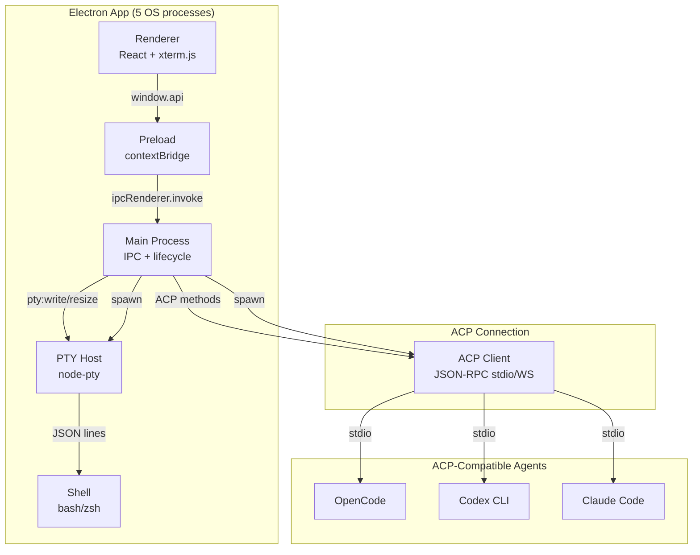

# Androdex — ACP Integration & Architecture v2

## Goal

Rebuild Androdex as an **agent-agnostic** Electron GUI using the Agent Client Protocol (ACP). Drop direct OpenCode SDK dependency in favor of ACP — works with Codex, Claude Code, OpenCode, or any ACP-compatible agent. Use `@pierre/diffs` and `@pierre/trees` for UI polish.

---

## Architecture Comparison

```mermaid
flowchart LR
    subgraph v1["Current (v1) — OpenCode SDK"]
        A1[Renderer] --> B1[IPC]
        B1 --> C1[@androdex/server]
        C1 --> D1[@opencode-ai/sdk]
        D1 --> E1[OpenCode only]
    end

    subgraph v2["Proposed (v2) — ACP"]
        A2[Renderer] --> B2[IPC]
        B2 --> C2[@androdex/server]
        C2 --> D2[ACP Client<br/>agentclientprotocol.com]
        D2 --> E2[Any ACP Agent<br/>Codex / Claude / OpenCode]
    end
```

## Process Architecture (v2)



## Changes from v1 Plan

### 1. ACP Replaces OpenCode SDK

| Layer | v1 (current) | v2 (proposed) |
|---|---|---|
| Server package | `@opencode-ai/sdk/v2/client` | `@agentclientprotocol/typescript` (ACP TS lib) |
| Agent support | OpenCode only | Any ACP agent (Codex, Claude, OpenCode) |
| Error handling | `wrap(domain, fn)` | ACP errors + `wrap()` |
| IPC channels | 28 OpenCode-specific | ACP-standard (sessions, prompts, tool calls, files, terminals) |

**ACP methods we'd use:**

| ACP Method | Purpose |
|---|---|
| `session/create` | Start agent session |
| `session/list` | List sessions |
| `session/delete` | Delete session |
| `session/resume` | Resume session |
| `session/close` | Close session (new — ACP has this) |
| `prompt/turn` | Send user message, get response |
| `prompt/cancel` | Abort in-progress turn |
| `tool/calls` | Tool execution events |
| `files/read` | Read file content |
| `files/write` | Write file content |
| `files/list` | List directory |
| `terminal/exec` | Run terminal command in agent sandbox |
| `initialization` | Handshake + capability negotiation |

**Not in ACP (need alternatives):**
- `vcs.get/status/diff` — ACP doesn't have built-in VCS. Options: (a) use OpenCode SDK just for VCS, (b) call `git` CLI directly from main process, (c) use OpenCode's `client.vcs.*` as a fallback for OpenCode-only users
- `search.text/files/symbols` — ACP doesn't have search. Options: (a) use ripgrep from main process, (b) skip for v2
- `config.get/update/providers` — ACP doesn't have this. Agent-specific config lives in the agent's own system
- `events/subscribe` — ACP uses prompt turn streaming instead of SSE

### 2. `@pierre/diffs` Replaces Custom DiffPanel

| Aspect | v1 (custom) | v2 (@pierre/diffs) |
|---|---|---|
| Lines of code | ~200+ | 0 (just config) |
| Syntax highlighting | None | Shiki (full language support) |
| Inline changes | Manual | Built-in (word/char level) |
| Themes | Manual | Any Shiki theme |
| Annotations | Not planned | Built-in |
| Accept/reject | Not planned | Built-in |
| Line selection | Not planned | Built-in |

```tsx
import { Diffs } from "@pierre/diffs"

function DiffPanel() {
  return (
    <Diffs
      diff={diffData}
      layout="stacked" // or "split"
      theme={theme}
      inlineDiff="word"
      enableLineSelection
    />
  )
}
```

### 3. `@pierre/trees` for File Explorer

Only needed when we add a file tree sidebar. If/when we do:

| Aspect | Custom | @pierre/trees |
|---|---|---|
| Virtualization | Manual | Built-in (10k+ items) |
| Git status | Manual | Built-in (M/A/D/R/U) |
| Search/filter | Manual | Built-in (3 modes) |
| Drag-drop | Manual | Built-in |
| Rename | Manual | Built-in |
| Icons | Manual | 3 built-in sets |
| SSR hydration | N/A | Built-in |

```tsx
import { useFileTree, FileTree } from "@pierre/trees/react"

function FileSidebar() {
  const model = useFileTree({
    paths: filePaths,
    gitStatus: gitEntries,
    search: true,
    flattenEmptyDirectories: true,
  })
  return <FileTree model={model} className="h-full" />
}
```

### 4. `@androdex/server` Package Changes

**Before (v1):**
```
packages/server/
├── index.ts        ← createClient() wrapping @opencode-ai/sdk
├── package.json    ← dep: @opencode-ai/sdk
└── tsconfig.json
```

**After (v2):**
```
packages/server/
├── index.ts        ← createACPClient() wrapping ACP protocol
├── adapters/       ← agent-specific adapters
│   ├── opencode.ts ← OpenCode SDK fallback (VCS, search)
│   └── codex.ts    ← Codex-specific setup
├── package.json    ← dep: @agentclientprotocol/typescript
└── tsconfig.json
```

`createACPClient()` returns the same shape as before (`.sessions`, `.vcs`, `.files`, etc.) but routes through ACP internally. The IPC layer doesn't change — same 28 channels, same signatures. Only the server package internals change.

### 5. IPC Layer — No Change

The IPC contract (28 channels + 5 terminal) stays identical. The renderer never knows whether it's talking to OpenCode SDK or ACP. This is the key design constraint — all of v2 is a **drop-in replacement** for `@androdex/server`.

```mermaid
flowchart LR
    R[Renderer] -->|window.api.listSessions()| I[IPC]
    I -->|opencode:listSessions| S[@androdex/server v2]
    S -->|ACP session/list| A[Any ACP Agent]
    
    style I fill:#48f,color:#fff
    style S fill:#f80,color:#fff
```

### 6. Library Dependencies

Add to `apps/desktop/package.json`:

```json
{
  "dependencies": {
    "@pierre/diffs": "^1.2.10",
    "@pierre/trees": "^1.0.0-beta.4"
  }
}
```

---

## Implementation Order (v2)

### Phase 1: Libraries (no ACP yet)
1. Install `@pierre/diffs`, `@pierre/trees` in apps/desktop
2. Build DiffPanel using `@pierre/diffs` — stacked/split, inline changes, Shiki themes
3. Build FileSidebar using `@pierre/trees` — paths, git status, search, virtualization
4. Wire file tree to `client.files.list()` and `client.vcs.status()` (still via OpenCode SDK)

### Phase 2: ACP Integration
5. Add `@agentclientprotocol/typescript` to `packages/server/`
6. Create `createACPClient()` — ACP transport layer (stdio spawn)
7. Implement session methods: `create`, `list`, `delete`, `resume`, `close`
8. Implement prompt method: `prompt/turn` with streaming support
9. Implement files methods: `read`, `write`, `list`
10. Create OpenCode adapter for VCS + search (falls back to OpenCode SDK)

### Phase 3: Agent Selection UI
11. Add agent selector dropdown (Codex / Claude Code / OpenCode)
12. Agent-specific config panels (API key, model, etc.)
13. ACP capability negotiation on agent switch

### Phase 4: Polish
14. ACP error handling + reconnection
15. Streaming agent responses (token by token via ACP prompt turn)
16. Remove `@opencode-ai/sdk` dependency (once VCS/search are replaced)

---

## Key Decisions

| Decision | Choice | Rationale |
|---|---|---|
| ACP vs OpenCode SDK | ACP as default, OpenCode adapter for VCS/search | Agent-agnostic now, migrate full later |
| IPC change | None | Renderer is decoupled from backend |
| Diff UI | `@pierre/diffs` | 0 code, Shiki themes, inline changes |
| File tree | `@pierre/trees` | Virtualized, git status, search, drag-drop |
| VCS solution | OpenCode adapter (phase 1), native `git` CLI (phase 4) | Shortest path to ACP, then pure ACP |
| Search solution | ripgrep from main process | ACP doesn't have search; rg is universal |
| Agent config | In-app UI per agent type | ACP handles agent-agnostic, app handles provider-specific |
| Streaming | ACP prompt turn streaming | Push-based, replaces SSE pattern |

---

## Migration Path

```
Phase 1 (libraries) ──────────────────────────→
  │                                              │
  ├─ Add @pierre/diffs, @pierre/trees           │
  ├─ Build DiffPanel + FileSidebar               │
  │                                              │
Phase 2 (ACP core) ────────────────────────────→
  │                                              │
  ├─ createACPClient() in packages/server         │
  ├─ Sessions + prompts + files via ACP           │
  ├─ Keep OpenCode SDK for VCS + search           │
  │                                              │
Phase 3 (agent UI) ────────────────────────────→
  │                                              │
  ├─ Agent selector: Codex / Claude / OpenCode   │
  ├─ Config panels per agent                     │
  │                                              │
Phase 4 (cleanup) ─────────────────────────────→
  │                                              │
  ├─ Replace VCS with native git CLI             │
  ├─ Replace search with ripgrep                 │
  ├─ Drop @opencode-ai/sdk dependency            │
  └─ Pure ACP + native tools                     │
```

Each phase is independently shippable. Phase 1 works with the existing OpenCode SDK. Phase 2 adds ACP alongside it. Phase 4 removes the SDK entirely.

---

## Risk Assessment

| Risk | Impact | Mitigation |
|---|---|---|
| ACP TS library not mature | Blocking for phases 2-4 | Keep OpenCode SDK as fallback |
| ACP doesn't have method we need | Missing features | OpenCode adapter bridge |
| Agent compatibility differences | UX inconsistencies | Adapter pattern normalizes behavior |
| Ripgrep not available on system | Search broken | Fallback to Node.js `fs` walk + grep |
| `@pierre/trees` beta API shifts | Maintenance cost | Pin version, minimal wrapper layer |
